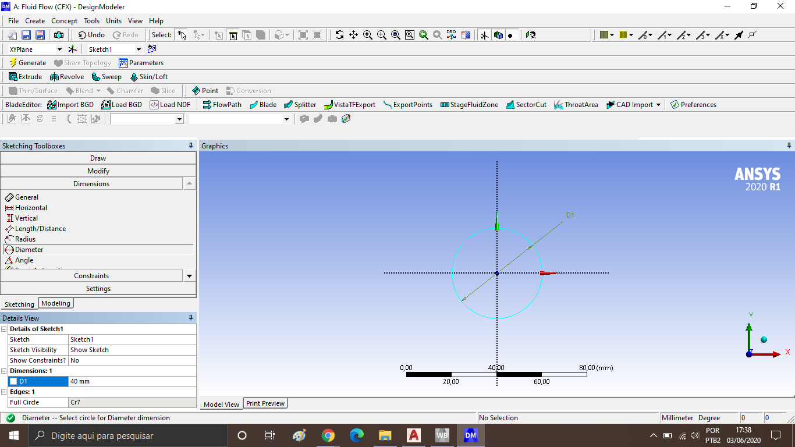
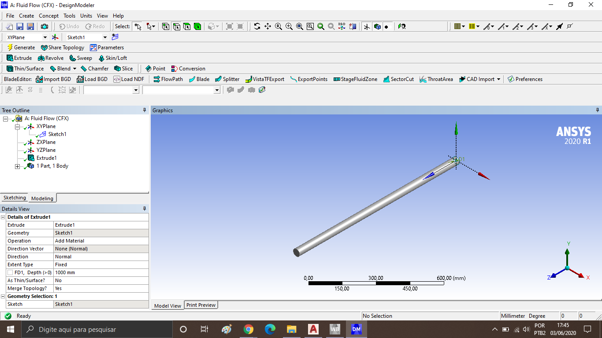

# Helena-Barbosa--180032836

**Nota escolhida para substituição:** Nota do Laboratório 

**Problema escolhido:** Problema 1 

Problema 1: Uma instalação de bombeamento tem apresentado problemas em uma seção de tubulação de 1 metro de comprimento e 40 mm de diâmetro. A perda de carga foi medida usando sensores de pressão, e mensurou-se uma queda de pressão de 2 Pa. A bomba que supre esta tubulação com água está operando em potência máxima. Também mediu-se a vazão deste escoamento, obtendo um valor de 0,0001 metro cúbico por segundo na saída do tubo. O projeto de CFD deve:

- Determinar se estes valores de vazão e perda de carga estão coerentes ou não, e o motivo para isto.
- Apresentar possibilidades de problemas em caso dos valores colocados acima não estarem coerentes.
- Usando a simulação apresentada, realizar um estudo paramétrico do fator de atrito para avaliar se o cenário acima é normal ou não para esta instalação.

### 1. Modelagem: 

A primeira etapa deverá conter as respostas para as seguintes perguntas:

- Qual é o objetivo do projeto?
    
    O projeto consiste em analisar a instalação de bombeamento apontada no Problema 1 a qual apresenta problemas em uma determinada seção da tubulação, com os dados apresentados o objetivo deste projeto é obter uma simulação confiável através da Dinâmica dos Fluidos Computacional do problema, utilizando o Software Ansys Student e portanto averiguar através da teoria se os dados apresentados e os resultados computados nas simulações são consistentes com a realidade, além de levar em consideração o parâmetro do Fator de atrito e realizar um estudo paramétrico para definir a normalidade do cenário da instalação apresentada.

- Quais são seus requisitos de solução?

    O requisito de solução do Projeto de CFD é o fator de atrito e os parâmetros necessários para o seu cálculo, como por exemplo a velocidade do escoamento, o diâmetro do tubo na seção mencionada, a viscosidade do fluido e a sua massa específica.    
    
- Qual é a finalidade do projeto?

    O projeto tem finalidade acadêmica para demonstração e visualização do escoamento citado e do parâmetro escolhido,no caso deste projeto é o fator de atrito, através da simulação computacional e de cálculos feitos previamente utilizando a teoria de Dinâmica dos Fluidos será possível caracterizar o escoamento e confirmar os resultados obtidos por ambas as formas.
    
- Que hipóteses de simplificação podem ser adotadas?

    1) Utilizar cálculos simples, porém eficazes para obter informações sobre o escoamento de acordo com os dados fornecidos, como por       exemplo a equação de Bernoulli e as definições de vazão volumétrica para o cálculo da velocidade do fluido.
    2) Adotar apenas os parâmetros necessários para os cálculos. 
    
- Que hipóteses de simplificação devem ser adotadas?

    1) O escoamento será considerado laminar devido às características do fluido e do tubo.
    2) A geometria do tubo é considerada simples, possibilitando a criação de uma malha boa e fiel para análise e simulação porém não       complexa demais para a demanda do problema.
    3) O problema considera regime permanente.
    4) Trocas de calor não serão consideradas.
    
- Qual é a precisão requerida nos resultados do projeto?

    Devido ao projeto possuir um formato não muito complexo e ser caracterizado como um projeto acadêmico para simulação e comparação de dados, a precisão necessária será definida através dos cálculos e será o suficiente para a avaliação do problema.
    
- Qual é o prazo de entrega do projeto?

    O projeto será dividido em 3 etapas: 
    1- Modelagem;
    2- Pré- processamento;
    3- Processamento e pós-processamento.
    
    A etapa de Modelagem tem o prazo de aproximandamente uma semana até o recebimento do Feedback e a partir da efetuação das correções necessárias as etapas seguintes apresentarão novos prazos de acordo com a necessidade.
    
- Há outra metodologia mais adequada do que CFD?
    
    O projeto consiste em uma análise e comparação das simulações feitas em CFD e os cálculos, portanto para o resultado sólido, os cálculos utilizando equação de Bernoulli, número de Reynolds e sua relação com o fator de atrito já são suficientes, porém por conta da natureza do projeto a simulação é importante para esta comparação, mas não necessariamente a mais adequada para apresentar os resultados pedidos.

O projeto deverá conter nesta etapa:

- Desenhos CAD mostrando a geometria do problema.
- Desenho esquemático da modelagem do problema.

I) Imagem 1: Sketch com cotagem do diâmetro do tubo.

II) Imagem 2: Extrude do Sketch --> geometria final do tubo.

III) Imagem 3: Desenho esquemático da modelagem do problema, elaborado no AutoCAD.

